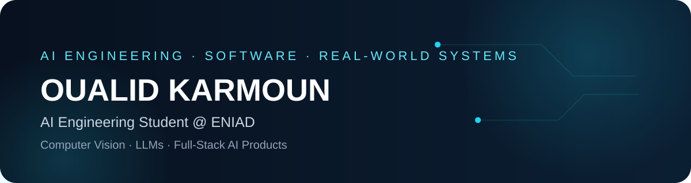

  
  
  

  
   
  <strong>AI Engineering student focused on practical AI systems, strong software engineering and real-world products.</strong>

 

I'm an **Artificial Intelligence engineering student at ENIAD** building practical systems at the intersection of **AI and software engineering**. I enjoy taking a problem from data and model experimentation to a usable product, with a particular interest in **computer vision, LLMs, RAG, AI agents and full-stack AI applications**.

- **AI & computer vision.** I worked on mammography classification and segmentation during my internship at **CHU Mohammed VI, Oujda**, experimenting with CNN architectures, transfer learning and U-Net.
- **Applied AI.** I build projects that connect models to real applications, including AI assistants, agricultural platforms and intelligent web systems.
- **Full-stack engineering.** I work across React, Django, Flask, Node.js/Express, PostgreSQL, MongoDB and deployment platforms such as Vercel.
- **Current direction.** Deepening my skills in **LLMs, RAG, AI agents, computer vision and production AI engineering**.

I work in **Arabic, French and English**.

 

### Real or Clone? · detecting AI voice-cloning scams from voice notes

**Real or Clone?** is the AI project I currently find the most meaningful: a mobile-first system built with my team **GOATAT** during the **GOMYCODE × NVIDIA — Come Build with AI** hackathon in Morocco. The goal is practical and immediate — help a user check a suspicious WhatsApp-style voice note before trusting an urgent request for money.

The system uses a **fine-tuned XLS-R 300M audio model** to classify a recording as a real voice or an AI-generated clone. The app does more than return a label: it shows a confidence-oriented result, highlights suspicious seconds in the audio, keeps a private history, and gives safety guidance after the verdict.

**What we built**
- Upload or record a voice note directly from a mobile-first interface.
- Compare the base XLS-R model with our fine-tuned model.
- Detect suspicious regions in an audio sample instead of showing only a final class.
- Dashboard with evaluation metrics, before/after experiments and confusion matrices.
- Multilingual interface and safety guidance in **Arabic, French and English**.
- Private history for previous checks.

**Model evaluation shown in the project:** **96.1% accuracy** on the held-out test set, **2.4% EER** on unseen TTS generators, and **7.2% of real voices wrongly flagged** in the reported final evaluation. These numbers come from the project's held-out evaluation and should be read in that test context.

`PyTorch` `XLS-R 300M` `Audio Deep Learning` `Fine-tuning` `NVIDIA` `FastAPI` `Web App`

→ **[Code & results](https://github.com/ilyasdaoudrma/real-or-clone)**

 

<table>
  <tr>
    <td width="50%" valign="top">
      
      
<b>Evaluation dashboard</b> Held-out metrics, EER comparisons and confusion matrices make the model behavior visible instead of hiding it behind a single score.

    </td>
    <td width="50%" valign="top">
      
      
<b>Mobile + multilingual</b> The interface is designed for phone use and supports Arabic, French and English safety guidance.

    </td>
  </tr>
</table>

 

### FLAMBEAU · AI-assisted e-commerce

A premium home-fragrance e-commerce platform with a **real backend, server-side checkout validation, stock management, Google Sheets persistence and an AI shopping assistant powered through Hugging Face**.

`JavaScript` `Node.js` `Vercel` `Google Apps Script` `Google Sheets` `Hugging Face` `LLM`

→ **[Live](https://flambeau-shop.vercel.app/)** · **[Code](https://github.com/oualidkarmoun/flambeau-shop)**

 

<table>
  <tr>
    <td width="50%" valign="top">
      
      <h3>Café Manager</h3>
      
A real-time café management system for orders, stock, daily declarations, staff roles and reporting. The full application uses Django REST Framework, Channels and PostgreSQL, with a React frontend.

      
<code>React</code> <code>Django</code> <code>DRF</code> <code>Channels</code> <code>PostgreSQL</code>

      
→ <b><a href="https://cafe-manager-beta.vercel.app/">Demo</a></b> · <b><a href="https://github.com/oualidkarmoun/cafe-realtime-app">Full project</a></b>

    </td>
    <td width="50%" valign="top">
      <h3>AGRISHAMA</h3>
      
An agriculture-focused platform connecting students, companies and farmers. It supports academic/job opportunities, profile discovery and agricultural product listings.

      
<code>React</code> <code>Django</code> <code>PostgreSQL</code> <code>Redis</code>

      
<b>Built end-to-end independently</b>, from frontend and backend to database design.

    </td>
  </tr>
</table>
 

<b>More projects & research</b>

 

| Project | What I worked on | Stack |
|---|---|---|
| **Mammography AI — CHU Oujda** | Classification and segmentation experiments for normal, benign and malignant mammograms; CNN/transfer-learning architectures and U-Net. | Python · TensorFlow · PyTorch · scikit-learn |
| **Intelligent Web Crawler** | Final-year project for website structure analysis, links, redirects and errors through a Flask interface and interactive maps. | Python · Flask · Leaflet |
| **Mobile POS & Billing App** | Offline-first Flutter POS with product CRUD, barcode/QR scanning, cart calculations and Bluetooth thermal receipt printing. | Flutter · Hive · Bluetooth |
| **SolidarIA** | Hackathon prototype: an AI chatbot for Morocco's social and solidarity economy with Darija/French support and an interactive map. | Flask · LLM API · Web |

 

 

### Education

**Engineering Cycle — Artificial Intelligence**  
**ENIAD, Berkane** · 2025 — Present

**DUT — Business Intelligence & Machine Learning**  
**EST Oujda** · 2023 — 2025 · Mention Bien

### Experience

**AI / Computer Vision Intern — CHU Mohammed VI, Oujda**  
Worked on mammography classification and segmentation, model experimentation and evaluation.

**Web Development Intern — El Hore Travaux, Oujda**  
Built a construction-project management web application with HTML, CSS, JavaScript, PHP and MySQL.

 

  
   
  
  
  
  
  
  

| | |
|---|---|
| **AI & data** | Python · TensorFlow · PyTorch · scikit-learn · NumPy · pandas · Computer Vision · Deep Learning · LLMs · RAG |
| **Backend** | Django · Django REST Framework · Flask · Node.js · Express · REST APIs · JWT |
| **Frontend** | React · JavaScript · HTML · CSS · Tailwind · Bootstrap |
| **Databases** | PostgreSQL · MySQL · MongoDB · SQLite · Oracle · Redis |
| **Engineering** | Git · GitHub · Vercel · Docker · Postman · Jupyter · Colab · Power BI |

 

I'm interested in **AI engineering, machine learning, computer vision, LLM applications and full-stack AI products**, with a focus on projects that solve real problems.

The fastest way to reach me is **[LinkedIn](https://www.linkedin.com/in/oualid-karmoun/)** or **[oualidkarmoun@gmail.com](mailto:oualidkarmoun@gmail.com)**.

  

